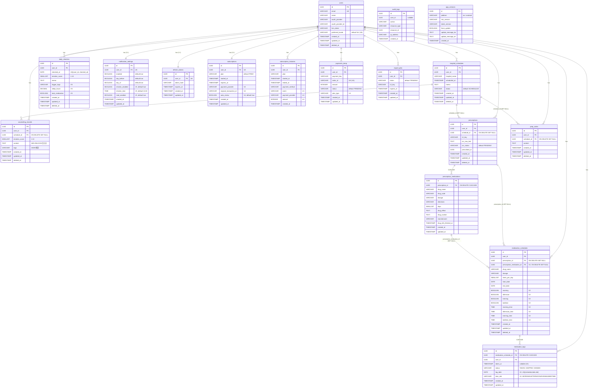

# DearMI — Entity Relationship Diagram

> V1 ~ V6 마이그레이션 기준 전체 DB 스키마

```mermaid
erDiagram

    %% ──────────────────────────────────────────────
    %% users (V1 + V6)
    %% ──────────────────────────────────────────────
    users {
        UUID id PK
        VARCHAR email UK
        VARCHAR name
        VARCHAR oauth_provider
        VARCHAR oauth_provider_id
        VARCHAR fcm_token
        VARCHAR preferred_locale "default 'ko' (V6)"
        TIMESTAMP created_at
        TIMESTAMP updated_at
        TIMESTAMP deleted_at
    }

    %% ──────────────────────────────────────────────
    %% hospital_schedules
    %% ──────────────────────────────────────────────
    hospital_schedules {
        UUID id PK
        UUID user_id FK
        VARCHAR hospital_name
        TIMESTAMP scheduled_at
        TEXT memo
        VARCHAR status "default 'SCHEDULED'"
        TIMESTAMP created_at
        TIMESTAMP updated_at
        TIMESTAMP deleted_at
    }

    %% ──────────────────────────────────────────────
    %% counseling_records
    %% ──────────────────────────────────────────────
    counseling_records {
        UUID id PK
        UUID user_id FK
        UUID schedule_id FK "ON DELETE SET NULL"
        SMALLINT emotion_score "1-10"
        TEXT content "AES-256-GCM 암호화"
        VARCHAR tags "JSON 배열"
        TIMESTAMP created_at
        TIMESTAMP updated_at
        TIMESTAMP deleted_at
    }

    %% ──────────────────────────────────────────────
    %% daily_checkins (V1 + V5)
    %% ──────────────────────────────────────────────
    daily_checkins {
        UUID id PK
        UUID user_id FK
        DATE checked_at "UQ(user_id, checked_at)"
        SMALLINT emotion_score "1-10"
        TEXT memo
        VARCHAR trigger_tags "V5"
        DECIMAL sleep_hours "V5"
        BOOLEAN took_medication "V5"
        TIMESTAMP created_at
        TIMESTAMP updated_at
        TIMESTAMP deleted_at
    }

    %% ──────────────────────────────────────────────
    %% prescriptions
    %% ──────────────────────────────────────────────
    prescriptions {
        UUID id PK
        UUID user_id FK
        UUID schedule_id FK "ON DELETE SET NULL"
        VARCHAR s3_key
        TEXT ocr_raw_text
        VARCHAR ocr_status "default 'PENDING'"
        DATE prescribed_at
        TIMESTAMP created_at
        TIMESTAMP updated_at
        TIMESTAMP deleted_at
    }

    %% ──────────────────────────────────────────────
    %% prescription_medications
    %% ──────────────────────────────────────────────
    prescription_medications {
        UUID id PK
        UUID prescription_id FK "ON DELETE CASCADE"
        VARCHAR drug_name
        VARCHAR drug_code
        VARCHAR dosage
        VARCHAR directions
        SMALLINT days
        TEXT drug_effect
        TEXT drug_caution
        VARCHAR manufacturer
        TIMESTAMP drug_info_fetched_at
        TIMESTAMP created_at
        TIMESTAMP updated_at
    }

    %% ──────────────────────────────────────────────
    %% medication_schedules (V1 + V2)
    %% ──────────────────────────────────────────────
    medication_schedules {
        UUID id PK
        UUID user_id FK
        UUID prescription_id FK "ON DELETE SET NULL"
        UUID prescription_medication_id FK "V2, ON DELETE SET NULL"
        VARCHAR drug_name
        VARCHAR dosage
        SMALLINT times_per_day
        DATE start_date
        DATE end_date
        BOOLEAN morning "V2"
        BOOLEAN afternoon "V2"
        BOOLEAN evening "V2"
        BOOLEAN bedtime "V2"
        TIME morning_time "V2"
        TIME afternoon_time "V2"
        TIME evening_time "V2"
        TIME bedtime_time "V2"
        TIMESTAMP created_at
        TIMESTAMP updated_at
        TIMESTAMP deleted_at
    }

    %% ──────────────────────────────────────────────
    %% medication_logs (V1 + V2)
    %% ──────────────────────────────────────────────
    medication_logs {
        UUID id PK
        UUID medication_schedule_id FK "ON DELETE CASCADE"
        UUID user_id FK
        TIMESTAMP taken_at "nullable (V2)"
        VARCHAR status "TAKEN / SKIPPED / MISSED"
        DATE log_date "V2, UQ(schedule,date,slot)"
        VARCHAR time_slot "V2, MORNING/AFTERNOON/EVENING/BEDTIME"
        TIMESTAMP created_at
        TIMESTAMP updated_at
    }

    %% ──────────────────────────────────────────────
    %% prep_notes
    %% ──────────────────────────────────────────────
    prep_notes {
        UUID id PK
        UUID user_id FK
        UUID schedule_id FK "ON DELETE SET NULL"
        TEXT content
        TIMESTAMP created_at
        TIMESTAMP updated_at
        TIMESTAMP deleted_at
    }

    %% ──────────────────────────────────────────────
    %% notification_settings (V1 + V3)
    %% ──────────────────────────────────────────────
    notification_settings {
        UUID id PK
        UUID user_id FK "UK"
        BOOLEAN enabled "default true"
        BOOLEAN day_before "default true"
        BOOLEAN day_of "default true"
        BOOLEAN checkin_enabled "V3, default true"
        TIME checkin_time "V3, default 21:00"
        BOOLEAN med_enabled "V3, default true"
        TIMESTAMP created_at
        TIMESTAMP updated_at
    }

    %% ──────────────────────────────────────────────
    %% refresh_tokens
    %% ──────────────────────────────────────────────
    refresh_tokens {
        UUID id PK
        UUID user_id FK "UK"
        VARCHAR token_hash
        TIMESTAMP expires_at
        TIMESTAMP created_at
        TIMESTAMP updated_at
    }

    %% ──────────────────────────────────────────────
    %% subscriptions (V1 + V4)
    %% ──────────────────────────────────────────────
    subscriptions {
        UUID id PK
        UUID user_id FK "UK"
        VARCHAR plan "default 'FREE'"
        TIMESTAMP started_at
        TIMESTAMP expires_at
        VARCHAR payment_provider "V4"
        VARCHAR original_transaction_id "V4"
        BOOLEAN auto_renew "V4, default true"
        TIMESTAMP created_at
        TIMESTAMP updated_at
    }

    %% ──────────────────────────────────────────────
    %% subscription_histories (V1 + V4)
    %% ──────────────────────────────────────────────
    subscription_histories {
        UUID id PK
        UUID user_id FK
        VARCHAR plan
        TIMESTAMP started_at
        TIMESTAMP ended_at
        VARCHAR payment_method
        VARCHAR event "V4"
        VARCHAR payment_provider "V4"
        INTEGER amount "V4"
        TIMESTAMP created_at
    }

    %% ──────────────────────────────────────────────
    %% audit_logs
    %% ──────────────────────────────────────────────
    audit_logs {
        UUID id PK
        UUID user_id "nullable"
        VARCHAR action
        VARCHAR resource_type
        UUID resource_id
        VARCHAR ip_address
        TIMESTAMP created_at
    }

    %% ──────────────────────────────────────────────
    %% payments_temp (V1 + V4)
    %% ──────────────────────────────────────────────
    payments_temp {
        UUID id PK
        UUID user_id FK
        VARCHAR payment_key
        VARCHAR order_id "UK (V4)"
        INTEGER amount
        VARCHAR status "default 'PENDING'"
        VARCHAR plan_type "V4"
        TIMESTAMP created_at
        TIMESTAMP updated_at
    }

    %% ──────────────────────────────────────────────
    %% export_jobs
    %% ──────────────────────────────────────────────
    export_jobs {
        UUID id PK
        UUID user_id FK
        VARCHAR status "default 'PENDING'"
        VARCHAR s3_key
        TIMESTAMP expires_at
        TIMESTAMP created_at
        TIMESTAMP updated_at
    }

    %% ──────────────────────────────────────────────
    %% app_versions (독립 테이블)
    %% ──────────────────────────────────────────────
    app_versions {
        UUID id PK
        VARCHAR platform "ios / android"
        VARCHAR min_version
        VARCHAR latest_version
        BOOLEAN force_update
        TEXT update_message_ko
        TEXT update_message_en
        TIMESTAMP created_at
    }

    %% ══════════════════════════════════════════════
    %% Relationships
    %% ══════════════════════════════════════════════

    users ||--o{ hospital_schedules      : "has"
    users ||--o{ counseling_records      : "has"
    users ||--o{ daily_checkins          : "has"
    users ||--o{ prescriptions           : "has"
    users ||--o{ medication_schedules    : "has"
    users ||--o{ medication_logs         : "has"
    users ||--o{ prep_notes              : "has"
    users ||--|| notification_settings   : "has (1:1)"
    users ||--|| refresh_tokens          : "has (1:1)"
    users ||--|| subscriptions           : "has (1:1)"
    users ||--o{ subscription_histories  : "has"
    users ||--o{ payments_temp           : "has"
    users ||--o{ export_jobs             : "has"

    hospital_schedules ||--o{ counseling_records  : "schedule_id (SET NULL)"
    hospital_schedules ||--o{ prescriptions       : "schedule_id (SET NULL)"
    hospital_schedules ||--o{ prep_notes          : "schedule_id (SET NULL)"

    prescriptions ||--o{ prescription_medications : "CASCADE"
    prescriptions ||--o{ medication_schedules     : "prescription_id (SET NULL)"

    prescription_medications ||--o{ medication_schedules : "prescription_medication_id (SET NULL)"

    medication_schedules ||--o{ medication_logs   : "CASCADE"
```
