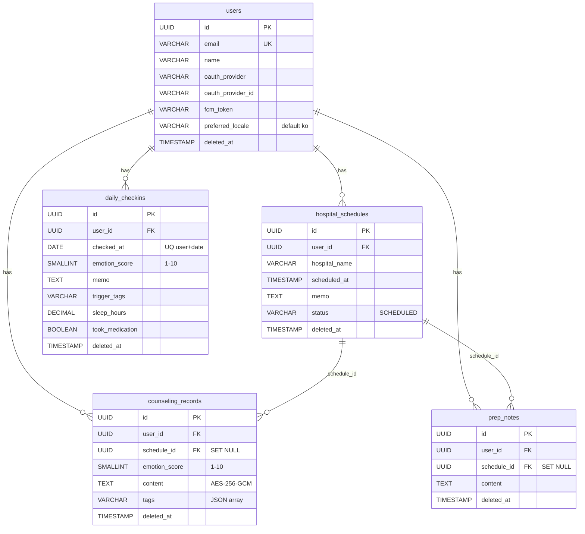
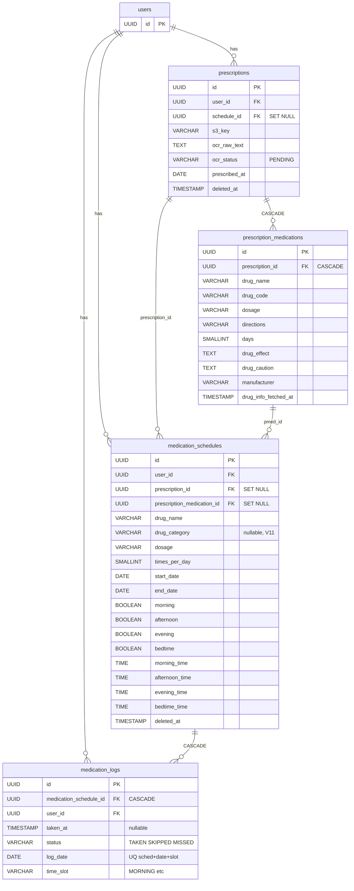
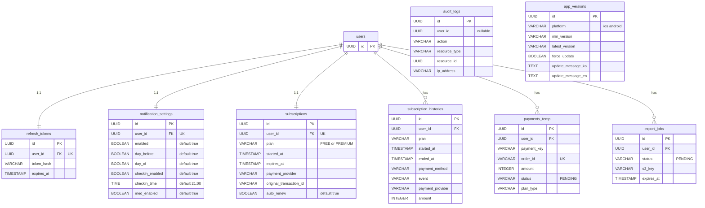

# DearMI — Entity Relationship Diagram

> V1 ~ V11 마이그레이션 기준 전체 DB 스키마
>
> 공통 컬럼(`created_at`, `updated_at`)은 모든 테이블에 존재하나 가독성을 위해 생략.
> `deleted_at`은 소프트 삭제 대상 테이블만 별도 표기.

## 1. 진료 도메인 (일정 · 상담 · 준비 메모)

## 2. 처방 · 복약 도메인

## 3. 인증 · 구독 · 결제 · 시스템

## FK 삭제 정책 요약

| 삭제 대상 | 연관 테이블 | 정책 |
|---|---|---|
| `hospital_schedules` | `counseling_records.schedule_id` | `SET NULL` |
| `hospital_schedules` | `prescriptions.schedule_id` | `SET NULL` |
| `hospital_schedules` | `prep_notes.schedule_id` | `SET NULL` |
| `prescriptions` | `prescription_medications` | `CASCADE` |
| `prescriptions` | `medication_schedules.prescription_id` | `SET NULL` |
| `prescription_medications` | `medication_schedules.prescription_medication_id` | `SET NULL` |
| `medication_schedules` | `medication_logs` | `CASCADE` |
